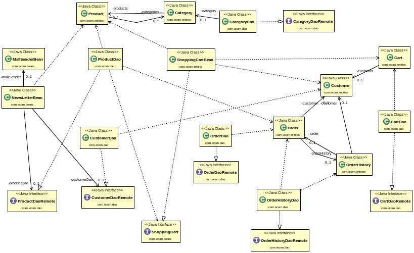
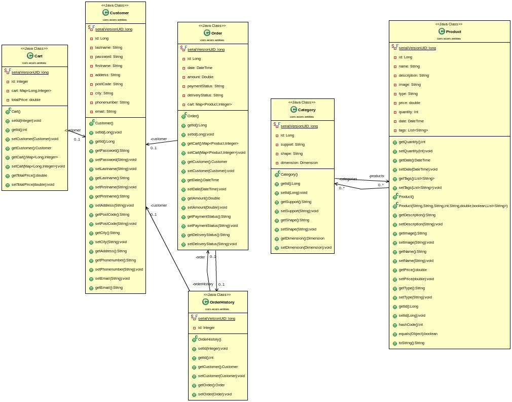

Dossier de conception système
=============================

Schéma d'Architecture Système (SAS)
-----------------------------------

Entités
-------

Pour développer notre version v1 de notre site de vente de stickers personnalisés, nous avons mis en place divers composants.
Tout d'abord voici le contenu des divers entités qui compose notre application : Client, Produit, Catégorie, Panier, Commande.
Chaque entité correspond à une table dans notre base de données, et nous verrons dans ce document les liens entre chacune des ces entités.

- Customer
	Attributs :
	 - id
	 - lastname : nom de l'utilisateur
	 - firstname : prénom de l'utilisateur
	 - address : adresse de l'utilisateur
	 - postCode : code postal
	 - city : ville
	 - phonenumber : numéro
	 - email : email

- Product
	Attributs :
	 - id
	 - name : nom du produit
	 - image : nom de l'image sur le serveur (dans notre cas, une image ne doit pas être enregistré le même nom). Une évolution consistera à utiliser des blobs et les stocker dans la base de données.
	 - description : descriptif du produit
	 - price : prix du produit
	 - quantity : quantité du produit disponible
	 - date : date de création du produit
	 - List<Category> categories : liste des catégories associées à un produit
	 - List<String> tags : liste des étiquettes ajoutées à la création du produit. Ces étiquettes vont permettre de rechercher un produit via la fonction de recherche. A l'avenir cette fonctionnalité pourrait être améliorée avec une recherche plus générale : recherche avec les noms de produits, mots de la description, etc...

- Category
	Attributs :
	 - id
	 - support : support du produit (sticker, magnette, etc...)
	 - shape : forme du produit (rectangle, rond, carré, etc...)
	 - dimension : Dimension2D, dimension (hauteur, largeur) du produit
	 - List<Product> products : liste des produits associés à cette catégorie

- Cart
	Attributs :
	 - id
	 - customer : client associé au panier
	 - Map<Long, Integer> cart : Map des produits présents dans le panier utilisateur (association produit/quantité)
	 - totalPrice : prix total du panier

- Order
	Attributs :
	 - id
	 - customer : client associé à la commande
	 - date : date de la commande
	 - amount : montant de la commande
	 - paymentStatus : status du paiement
	 - deliveryStatus : status de la livraison
	 - Map<Product, Integer> cart : Map des produits présents dans le panier utilisateur (association produit/quantité)
	 - orderHistory : historique auquel la commande est associée

- OrderHistory
	Attributs :
	 - id
	 - customer : client associé à l'historique
	 - order : commande associée à l'historique (un client peut avoir plusieurs commandes dans son historique stocké dans la base de données)

Nous pouvons donc voir dans un premier temps la relation ManyToMany entre les entités Category et Product. En effet, chaque catégorie peut-être associée à divers produits. Lors de l'initialisation d'un produit, celui-ci n'est associé à aucune catégorie. C'est au moment d'une commande qu'un utilisateur va choisir un produit et lui associer une catégorie. De manière réciproque, un produit peut être associé à plusieurs catégories.

Un autre point intéressant à soulever dans l'entité Product est la gestion des tags. A chaque produit à associé un ou plusieurs tags correspondant à des étiquettes qui vont permettre de recherche un produit grâce à des mots clés. Pour ce faire, on utilise l'annotation @ElementCollection : JPA va alors créer une nouvelle table qui contient deux colonnes et qui associe l'id d'un produit à une String correspondant à cette étiquettes.

Ensuite, nous avons une relation OneToOne entre une commande (Order) et un historique (OrderHistory). Nous aurions pu implémenter l'historique de manière différente (ManyToOne : à un historique est associé une ou plusieurs commande), mais cette technique nous simplifie le requêtage via la DAO. De plus on utilise l'annotation @OneToOne(cascade = CascadeType.PERSIST) : lors de la finalisation d'une commande, on crée une nouvelle commande (Order), que l'on associe à un historique (OrderHistory). Lors de la persistence en base de l'historique ainsi créé, la commande est automatiquement persisté elle aussi.

Les beans
---------

Chaque entité est associée à une bean stateless correspondant à une DAO (Data Access Object). Chaque DAO possède des méthodes permettant de communiquer avec la base de données (persist, merge, remove).

CartDao : 
	
	/**
	 * Renvoi le panier dont l'identifiant est id
	 */
	public Cart find(long id);

	/**
	 * Persiste dans la bdd le panier en paramètre
	 */
	public void create(Cart cart);

	/**
	 * Renvoie la liste de panier présent en bdd
	 */
	public List<Cart> list();
	
	/**
	 * Renvoie le panier associé à un utilisateur
	 * Utilisé lors de la connexion
	 */
	public Cart findCartByIdCustomer(long id);

	/**
	 * Supprimer un panier de la bdd
	 */
	public void remove(Cart cart);
	
	/**
	 * Merge un panier dans la bdd
	 */
	public void merge(Cart cart);

CategoryDao : 

	/**
	 * Renvoi la catégorie dont l'identifiant est id
	 */
	public Category find(long id);

	/**
	 * Persiste dans la bdd la catégorie en paramètre
	 */
	public void create(Category category);

	/**
	 * Renvoie la liste de catégories présent en bdd
	 */
	public List<Category> list();

	/**
	 * Supprimer une catégorie de la bdd
	 */
	public void remove(Category category);
	
	/**
	 * Renvoie une Map associant à une forme la liste des dimensions disponibles
	 */
	public Map<String,List<Dimension>> getCategories();

CustomerDao :

	/**
	 * Renvoi le client dont l'identifiant est id
	 */
	public Customer find(long id);

	/**
	 * Persiste dans la bdd le client en paramètre
	 */
	public void create(Customer customer);

	/**
	 * Renvoie la liste de clients présent en bdd
	 */
	public List<Customer> list();
	
	/**
	 * Méthode de vérification du mot de passe lors de la connexion 
	 * Renvoie le client associé à l'email si le mot de passe est correct, null sinon
	 */
	public Customer checkPassword(String email, String password);

	/**
	 * Supprimer un client de la bdd
	 */
	public void remove(Customer customer);
	

	/**
	 * Méthode de vérification d'existance d'un client dans la bdd
	 * Renvoie true si l'email existe, false sinon
	 */
	boolean emailExists(String email);

OrderDao : 

	/**
	 * Renvoi la commande dont l'identifiant est id
	 */
	public Order find(long id);

	/**
	 * Persiste dans la bdd la commande en paramètre, cette méthode n'est pas utilisée lors de la validation de commande,
	 * en effet la persistence se fait en cascade avec l'enregitrement d'un orderHistory
	 */
	public void create(Order order);

	/**
	 * Renvoie la liste de commande présent en bdd
	 */
	public List<Order> list();

	/**
	 * Supprimer une commande de la bdd
	 */
	public void remove(Order order);

OrderHistoryDao :

	/**
	 * Renvoi l'hitorique dont l'identifiant est id
	 */
	public OrderHistory find(long id);

	/**
	 * Persiste dans la bdd l'historique en paramètre
	 */
	public void create(OrderHistory orderH);

	/**
	 * Renvoie la liste d'historiques présent en bdd
	 */
	public List<OrderHistory> list();

	/**
	 * Supprimer un historique de la bdd
	 */
	public void remove(OrderHistory orderH);
	
	/**
	 * Renvoie l'historique associé à un client
	 */
	public List<OrderHistory> findHistoryByIdCustomer(long id);

ProductDao :

	/**
	 * Renvoi le produit dont l'identifiant est id
	 */
	public Product find(long id);

	/**
	 * Persiste dans la bdd le produit en paramètre
	 */
	public void create(Product product);

	/**
	 * Renvoie la liste de produit présent en bdd
	 */
	public List<Product> list();
	
	/**
	 * Renvoie la liste des 10 derniers produits enregistrés (nouveautés)
	 */
	public List<Product> listLastProducts();

	/**
	 * Supprimer un produit de la bdd
	 */
	public void remove(Product product);
	
	/**
	 * Méthode permettant de lister les produits associés à un tag
	 * Renvoie la liste des produits
	 */
	public List<Product> listWithTag(List<String> tags);
	
	/**
	 * Methode permettant de mettre à jour les stocks lors de la validation de commande
	 */
	public void updateProductQuantity(ShoppingCart shoppingCart);
	
	/**
	 * Méthode de vérification de disponibilité de produits
	 * Renvoie true si tous les produits de la commande sont en stock, false sinon
	 */
	public boolean checkAvailability(Order order);

Gestion du panier utilisateur (Stateful) : 
------------------------------------------

	Cette bean possède les attributs suivant : 
	 - id : id correspondant au client
	 - Map<Long, Integer> items : Map permettant d'associer l'id d'un produit à la quantité
	 - total : montant total du panier
	Cette bean possède plusieurs méthodes permettant de mettre à jour la Map correspondant au panier et le total du panier (méthode d'ajout d'article, de mise à jour de la quantité d'un article, de suppression d'un article du panier). Elle possède également des méthodes appelées en fin de session utilisateur ou lors de la déconnexion d'un utilsateur : ces méthodes permette de persister en base un Cart associé à l'utilisateur courant. Pour ce faire, l'utilisateur doit bien entendu être connecté. Ainsi, lors de la connexion d'un utilisateur, on vérifie dans la base de données si cet utilisateur ne possédait pas déjà de panier, et on initialise la bean avec le contenu du panier de la précédente connexion.

	Méthodes :

	void initialize();

	/**
	 * Ajoute un produit au panier 
	 * Met à jour la Map avec la clé produit et la quantité en valeur, ainsi que le prix total
	 */
	void addProduct(Long id, int quantity);

	/**
	 * Met à jour la Map panier et le total
	 */
	public void updateQuantity(Long id, int quantity);

	/**
	 * Retourne le montant total du panier
	 */
	public double getTotal();

	/**
	 * Enlève une quantité d'une produit du panier, cette méthode est aussi utilisée pour supprimer un produit du panier
	 */
	void removeProduct(Long id, int quantity);

	/**
	 * Retourne la liste des produits présents dans le panier
	 */
	public List<Long> getProductsById();

	/**
	 * Retourne une Map associant un produit à son identifiant
	 */
	public Map<Long, Product> getMapProducts();
	
	/**
	 * Retourne le panier utilisateur à la différence que la Map associe un produit à la quantité
	 */
	public Map<Product, Integer> getProductsMap();

	/**
	 * Retourne la quantité d'un produit dans le panier en fonction de son id
	 */
	int getQuantity(Long id);

	/**
	 * Set l'id du panier correspondant à l'identifiant du client
	 */
	void setId(Long id);

	/**
	 * Retourne l'identifiant du panier (l'identifiant du client associé au panier)
	 */
	public Long getId();

	public void initializeClientCart();

	/**
	 * Methode pour enregistrer le panier si utilisateur connecté lors de l'expiration d'une session
	 */
	public void release();
	
	/**
	 * Méthode pour fusionner le panier client et le panier session
	 */
	public void mergeClientCart();
	
	/**
	 * Retourne le panier
	 */
	public Map<Long, Integer> getCart();
	
	/**
	 * Vide le panier et remet le montant de panier à 0
	 */
	public void clear();
	
	/**
	 * Methode pour enregistrer le panier si utilisateur connecté lors d'une déconnexion
	 */
	public void saveCart();

Pour chaque bean, stateless ou stateful, ont été implémenté les interfaces respectives Local et Remote (via les annotations @Local et @Remote). Nous utilisons les interfaces Remote pour instancier nos EJB. Pour les beans stateless, nos DAO, l'instanciation se fait via l'utilisation de l'annotation @EJB. Pour la gestion du panier (stateful), l'instanciation de la bean se fait par conservation de référence (RMI, récupération via un lookup dans le contexte).

Gestion de l'envoi de mail : MailSenderBean
-------------------------------------------

Stateless, LocalBean :

	/**
	 * Default constructor.
	 */
	public MailSenderBean() {
		// TODO Auto-generated constructor stub
	}

	/**
	 * Méthode d'envoi de mail
	 * params : fromEmail email de l'envoyeur, username nom d'utilisateur de la boite mail, password mote de passe
	 * toEmail email du client à qui envoyer le mail, subject sujet du mail, message corps du message
	 */
	public void sendEmail(String fromEmail, String username, String password, String toEmail, String subject, String message}

Pour l'envoi de mail, l'application utilise le serveur de mail Gmail. La méthode sendEmail s'occupe de paramétrer l'envoi de mail et d'envoyer le mail au destinataire passé en paramètre.

Gestion de la newsletter : NewsLetterBean 
-----------------------------------------
@Singleton, @LocalBean, @Startup

	Attributs :

	@Resource
	private TimerService timerService;
	
	@EJB
	private MailSenderBean mailSender;
	
	@EJB
	private CustomerDaoRemote customerDao;

	Méthodes : 

	/**
	 * Initialisation de l'ejb timer qui permettra à son expiration d'envoyer un mail à tous les inscrits
	 */
	@PostConstruct
	private void init();
	

	/**
	 * Méthode d'envoi de la newsletter à toutes les personnes inscrites
	 */
	@Asynchronous
	@Timeout
	public void sendNewsLetter(Timer timer) throws ServletException, IOException;

La newsletter utilise un EJBTimer qui va permettre à intervalle régulier (à la manière d'un cron) d'effectuer une tâche. A expiration du timer, la méthode contenant l'annotation @Timeout est effectué. Elle utilise la DAO client afin de récupérer les adresses mail de tous les clients. Ensuite on utilise le mailSender vu précédemment pour procéder à l'envoi de la newsletter à chaque personne inscrite. Le mail contient notamment le nom des dernières nouveautées. 
