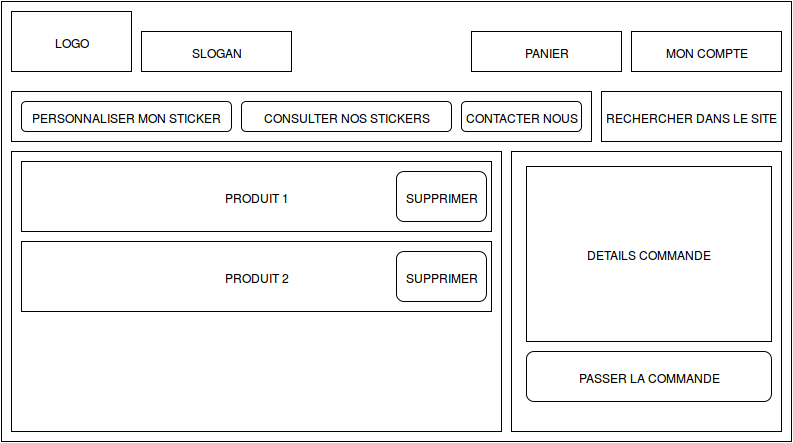

Introduction
============

Le projet eCOM consiste à concevoir et développer une application web. Une motivation principale du projet eCOM est qu'il intègre dans sa mise en œuvre différentes thématiques étudiées dans les formations en informatique : en particulier, interfaces homme-machine, applications et architectures réparties, bases de données. Les aspects relatifs au génie logiciel sont également présents puisque le projet eCOM comprend la conception et la réalisation d'un produit logiciel qui satisfait certains critères de qualité (documentation, respect des normes, etc).

L'intégration de différentes thématiques présente les atouts suivants :

    Valorisation des enseignements acquis dans les différentes thématiques au profit d'un projet important et réaliste.
    Appréhension des (inter)dépendances entre les thématiques.
    Communications entre les différents réalisateurs du projet. 

En outre, une deuxième motivation forte du projet eCOM est qu'il intègre des technologies et des standards récents et largement utilisés dans le domaine des applications Internet. Ce projet permet plus précisément de se placer en tant qu'utilisateurs de la technologie JEE (Java Enterprise Edition) destinée à la réalisation de serveurs d'information ou de serveurs de commerce électronique à base de composants distribués, transactionnels et persistants. Les réalisateurs sont confrontés par ce biais à la manipulation de mécanismes et de fonctions générales d'un système réparti : gestion de la désignation de composants distribués, configuration d'une application distribuée, association de propriétés non fonctionnelles aux composants (persistance, transactions), gestion des images persistantes des composants (liaisons avec une base de données). Des extensions au projet sont décrites ici et seront réalisées lors du projet RICOM/GICOM au semestre 2.

L'application réalisée devra offrir deux interfaces distinctes :

    les administrateurs qui gèrent les stocks de produits, les comptes des utilisateurs de l'application et le suivi des orderes ;
    les consommateurs/acheteurs qui peuvent consulter des articles, les placer dans leur caddie et valider une ordere. 

Chaque groupe devra élaborer un cahier des charges précis de l'application en termes de fonctionnalités et de critères d'ergonomie. Par ailleurs, le projet devra être réalisé en employant les méthodes et technologies présentées en cours. Ces différents aspects devront être validés par l'équipe pédagogique tout au long du projet. 

L'équipe 
--------

L’équipe est constituée de cinq étudiants en cinquième année de RICM. Trois viennent de l’option Système et réseau, les deux autres viennent de l’option Communication multimédia.

* Chef de projet : Alan Damotte
* Scrum Master : Quentin Torck
* Responsable développement : Jérémy Hammerer
* Responsable graphique : Rama Codazzi
* Responsable utilisabilité : Kai Guo
* Développeur : Toute l’équipe 

Wiki : http://air.imag.fr/index.php/ECOM_RICM5_Groupe2_2015

Ressources
----------

Voici la première maquette correspondant à la vue principale en arrivant sur notre site web : 

La maquette correspondant à la première étape de personnalisation d'un sticker : 

La maquette suivante présente la gestion du panier utilisateur : 

